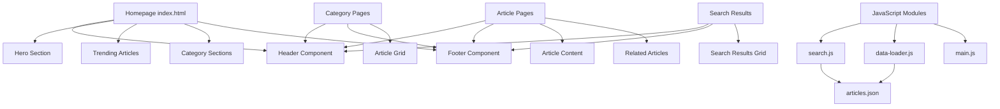

# Healthline Clone - Project Plan

## Project Overview

Build a static website similar to Healthline.com using HTML, CSS, and JavaScript. The site will include a homepage, article pages, navigation, search functionality, categories, and footer.

## Technology Stack

- **HTML5** - Semantic markup for all pages
- **CSS3** - Modern styling with Flexbox/Grid, CSS variables
- **JavaScript (Vanilla)** - Search functionality, dynamic content loading
- **JSON** - Data storage for articles and categories

## Project Structure

```
healthline-clone/
├── index.html                 # Homepage
├── css/
│   ├── styles.css            # Main stylesheet
│   ├── components.css        # Reusable components
│   └── responsive.css        # Media queries
├── js/
│   ├── main.js               # Main JavaScript file
│   ├── search.js             # Search functionality
│   └── data-loader.js        # Load JSON data
├── data/
│   ├── articles.json         # All articles data
│   └── categories.json       # Categories data
├── images/
│   ├── logo/                 # Logo variations
│   ├── articles/             # Article images
│   ├── categories/           # Category icons
│   └── icons/                # UI icons
├── pages/
│   ├── search-results.html   # Search results page
│   ├── categories/
│   │   ├── nutrition.html
│   │   ├── fitness.html
│   │   ├── mental-health.html
│   │   ├── wellness.html
│   │   ├── conditions.html
│   │   └── lifestyle.html
│   └── articles/
│       └── [30-40 article HTML files]
└── components/
    ├── header.html           # Header template
    └── footer.html           # Footer template
```

## Categories Structure

Based on Healthline, we will include these main categories:

1. **Nutrition** - Diet, supplements, healthy eating
2. **Fitness** - Exercise, workouts, physical health
3. **Mental Health** - Psychology, stress, mindfulness
4. **Wellness** - General health, prevention, self-care
5. **Conditions** - Diseases, treatments, symptoms
6. **Lifestyle** - Sleep, relationships, healthy habits

## Page Components

### 1. Header Component

```
┌─────────────────────────────────────────────────────────────────┐
│  LOGO          Nutrition Fitness Mental Health Wellness Search │
│                                                    🔍           │
└─────────────────────────────────────────────────────────────────┘
```

Features:
- Logo with link to homepage
- Main navigation menu with dropdown for subcategories
- Search bar with autocomplete
- Mobile hamburger menu

### 2. Homepage Layout

```
┌─────────────────────────────────────────────────────────────────┐
│                         HEADER                                  │
├─────────────────────────────────────────────────────────────────┤
│                    HERO SECTION                                 │
│           Featured Article with Large Image                     │
├─────────────────────────────────────────────────────────────────┤
│  TRENDING ARTICLES                                              │
│  ┌──────┐ ┌──────┐ ┌──────┐ ┌──────┐                          │
│  │ Art1 │ │ Art2 │ │ Art3 │ │ Art4 │                          │
│  └──────┘ └──────┘ └──────┘ └──────┘                          │
├─────────────────────────────────────────────────────────────────┤
│  CATEGORY SECTIONS                                              │
│  Nutrition    Fitness    Mental Health    Wellness              │
│  ┌────┐       ┌────┐     ┌────┐          ┌────┐               │
│  │    │       │    │     │    │          │    │               │
│  └────┘       └────┘     └────┘          └────┘               │
├─────────────────────────────────────────────────────────────────┤
│  NEWSLETTER SIGNUP                                              │
├─────────────────────────────────────────────────────────────────┤
│                         FOOTER                                  │
└─────────────────────────────────────────────────────────────────┘
```

### 3. Article Page Layout

```
┌─────────────────────────────────────────────────────────────────┐
│                         HEADER                                  │
├─────────────────────────────────────────────────────────────────┤
│  Breadcrumb: Home > Category > Article Title                    │
├─────────────────────────────────────────────────────────────────┤
│                    ARTICLE HERO IMAGE                           │
├─────────────────────────────────────────────────────────────────┤
│  ARTICLE TITLE                                                  │
│  By Author Name | Date | Read Time                              │
├─────────────────────────────────────────────────────────────────┤
│                                                                 │
│  ARTICLE CONTENT                                                │
│  - Introduction                                                 │
│  - Main sections with headings                                  │
│  - Key takeaways box                                            │
│  - Images and infographics                                      │
│                                                                 │
├─────────────────────────────────────────────────────────────────┤
│  AUTHOR BIO BOX                                                 │
├─────────────────────────────────────────────────────────────────┤
│  RELATED ARTICLES                                               │
│  ┌──────┐ ┌──────┐ ┌──────┐                                    │
│  │ Rel1 │ │ Rel2 │ │ Rel3 │                                    │
│  └──────┘ └──────┘ └──────┘                                    │
├─────────────────────────────────────────────────────────────────┤
│                         FOOTER                                  │
└─────────────────────────────────────────────────────────────────┘
```

### 4. Category Page Layout

```
┌─────────────────────────────────────────────────────────────────┐
│                         HEADER                                  │
├─────────────────────────────────────────────────────────────────┤
│  CATEGORY NAME                                                  │
│  Category description                                           │
├─────────────────────────────────────────────────────────────────┤
│  SUBCATEGORIES TABS                                             │
│  [All] [Subcat1] [Subcat2] [Subcat3]                           │
├─────────────────────────────────────────────────────────────────┤
│  ARTICLE GRID                                                   │
│  ┌──────┐ ┌──────┐ ┌──────┐ ┌──────┐                          │
│  │ Art1 │ │ Art2 │ │ Art3 │ │ Art4 │                          │
│  └──────┘ └──────┘ └──────┘ └──────┘                          │
│  ┌──────┐ ┌──────┐ ┌──────┐ ┌──────┐                          │
│  │ Art5 │ │ Art6 │ │ Art7 │ │ Art8 │                          │
│  └──────┘ └──────┘ └──────┘ └──────┘                          │
├─────────────────────────────────────────────────────────────────┤
│  LOAD MORE BUTTON                                               │
├─────────────────────────────────────────────────────────────────┤
│                         FOOTER                                  │
└─────────────────────────────────────────────────────────────────┘
```

### 5. Footer Component

```
┌─────────────────────────────────────────────────────────────────┐
│  ABOUT HEALTHLINE CLONE                                         │
│  Brief description of the website                               │
├─────────────────────────────────────────────────────────────────┤
│  CATEGORIES        FOLLOW US        NEWSLETTER                  │
│  Nutrition         Facebook         Email input                 │
│  Fitness           Twitter          Subscribe button            │
│  Mental Health     Instagram                                     │
│  Wellness          YouTube                                       │
│  Conditions                                                      │
│  Lifestyle                                                       │
├─────────────────────────────────────────────────────────────────┤
│  © 2024 Healthline Clone. All rights reserved.                  │
│  Privacy Policy | Terms of Service | Contact                    │
└─────────────────────────────────────────────────────────────────┘
```

## Design System

### Colors

| Color Name | Hex Code | Usage |
|------------|----------|-------|
| Primary Green | #00A86B | Buttons, links, highlights |
| Secondary Blue | #1E6B8C | Secondary elements |
| Dark Text | #1F1F1F | Main text |
| Light Text | #666666 | Secondary text |
| Background | #FFFFFF | Main background |
| Light Gray | #F5F5F5 | Section backgrounds |
| Border Gray | #E0E0E0 | Borders, dividers |

### Typography

| Element | Font | Size | Weight |
|---------|------|------|--------|
| H1 | Georgia, serif | 48px | 700 |
| H2 | Georgia, serif | 36px | 700 |
| H3 | Georgia, serif | 24px | 600 |
| Body | Arial, sans-serif | 16px | 400 |
| Small | Arial, sans-serif | 14px | 400 |
| Navigation | Arial, sans-serif | 15px | 500 |

### Spacing

- Base unit: 8px
- Small gap: 8px
- Medium gap: 16px
- Large gap: 24px
- XL gap: 32px
- Section padding: 48px

## Search Functionality

### Implementation

1. **Data Structure** - Articles stored in JSON format
2. **Indexing** - JavaScript creates search index on page load
3. **Autocomplete** - Shows suggestions as user types
4. **Results Page** - Displays matching articles with highlights

### JSON Data Structure

```json
{
  "articles": [
    {
      "id": "article-1",
      "title": "10 Benefits of Green Tea",
      "slug": "benefits-of-green-tea",
      "category": "nutrition",
      "subcategory": "beverages",
      "author": "Dr. Jane Smith",
      "date": "2024-01-15",
      "readTime": "5 min read",
      "image": "images/articles/green-tea.jpg",
      "excerpt": "Discover the amazing health benefits...",
      "content": "Full article content...",
      "tags": ["tea", "antioxidants", "health"]
    }
  ]
}
```

## Responsive Breakpoints

| Device | Breakpoint | Layout Changes |
|--------|------------|----------------|
| Desktop | > 1024px | Full layout |
| Tablet | 768px - 1024px | 2-column grid |
| Mobile | < 768px | Single column, hamburger menu |

## Implementation Phases

### Phase 1: Foundation
- Set up project structure
- Create base CSS styles and design system
- Build header and footer components

### Phase 2: Homepage
- Create homepage layout
- Add hero section
- Implement trending articles section
- Add category preview sections

### Phase 3: Category Pages
- Create category page template
- Implement article grid
- Add filtering functionality

### Phase 4: Article Pages
- Create article page template
- Style article content
- Add related articles section

### Phase 5: Search
- Create JSON data files
- Implement search functionality
- Create search results page

### Phase 6: Content
- Create all article pages (30-40 articles)
- Add images and content

### Phase 7: Polish
- Responsive design implementation
- Cross-browser testing
- Performance optimization

## File Count Estimate

| Type | Count |
|------|-------|
| HTML Pages | ~45-50 |
| CSS Files | 3 |
| JS Files | 3 |
| JSON Files | 2 |
| Images | ~60-80 |

## Architecture Diagram



## Next Steps

1. Review and approve this plan
2. Switch to Code mode to begin implementation
3. Start with project structure and base styles
